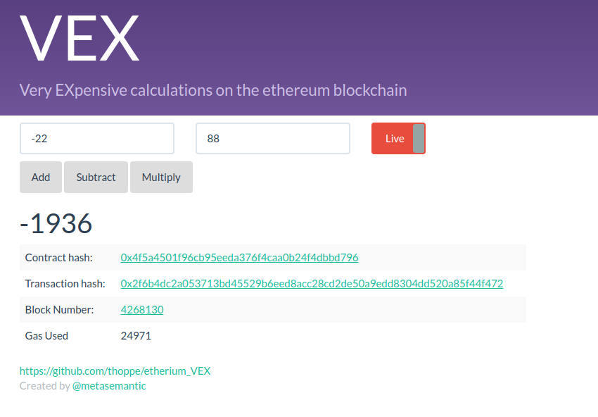

## [VEX](https://thoppe.github.io/etherium_VEX/index.html)

VEX is a Very EXpensive calculator built as a smart-contract on the Etherium blockchain. It is a proof-of-concept to show that arbitrary computations can be run on the blockchain by external computers (if you're willing to pay for it). The contract is deployed on the mainnet at the address

[0x4f5a4501f96cb95eEDA376F4caa0B24F4dbBD796](https://etherscan.io/address/0x4f5a4501f96cb95eeda376f4caa0b24f4dbbd796)

### Screenshot

### Run tests

    fab serve

### Run local instance

    testrpc # now open new window
    truffle migrate
    fab serve

### Setup on stock Ubuntu

    # Basic dependencies
    sudo apt-get install git build-essential

    # Install nvm
    sudo curl -o- https://raw.githubusercontent.com/creationix/nvm/v0.31.4/install.sh | bash

    # Install nodejs/npm
    nvm install 8

    # Install ethereum dependices and a server
    npm install -g ethereumjs-testrpc
    npm install -g truffle
    npm install -g lite-server

    # Install metamask (Chrome Extension)

    # Install fabric